# Jeffrey Wiley Archive Ecosystem - Visual Architecture

**Created:** December 1, 2025  
**Purpose:** Visual map of archive structure, cross-references, and domain relationships  
**Format:** Mermaid diagrams (render in Markdown viewers or Mermaid Live Editor)

---

## MASTER ARCHITECTURE: Archive Ecosystem

```mermaid
graph TB
    subgraph CORE["🎯 CORE ARCHIVE"]
        ARCHIVE[Jeffrey_Wiley_Resume_Archive_v1.5.1<br/>FSIQ 117 | GAI 122<br/>13,500 words]
    end
    
    subgraph COGNITIVE["🧠 COGNITIVE ASSESSMENT"]
        WAIS[WAIS-V Profile<br/>VCI 122 | WMI 122<br/>FRI 120 | PSI 120<br/>VSI 108]
        FSIQ[FSIQ: 117<br/>87th percentile<br/>Employment Positioning]
        GAI[GAI: 122<br/>93rd percentile<br/>Learning Potential]
        SPIKY[Spiky Profile<br/>14-point spread<br/>VSI 108 → VCI/WMI 122]
    end
    
    subgraph PROFESSIONAL["💼 PROFESSIONAL EXPERIENCE"]
        FREEMAN[Freeman Hybrid Tech Lead<br/>Apr 2024 - Oct 2025<br/>Training/Documentation]
        CHS[CHS Events Stage Manager<br/>Jan 2021 - Mar 2024<br/>Super Bowl LVI]
        HOLIUM[Holium Copywriter<br/>Aug-Nov 2023<br/>Urbit Assembly]
        FANSIDED[FanSided Writer<br/>Jun-Dec 2018<br/>22 Articles]
    end
    
    subgraph CREATIVE["🎨 CREATIVE OUTPUT"]
        MUSIC[4 Music Releases<br/>16 tracks, 97 minutes<br/>2015-2017]
        BOOKS[2 Editorial Credits<br/>ISBNs verified<br/>2021-2023]
        ARTICLES[22 Published Articles<br/>FanSided Network<br/>2018]
    end
    
    subgraph TECHNICAL["⚙️ TECHNICAL PROJECTS"]
        J3K[J3K Blockchain DAO<br/>GitHub<br/>FinTech Bootcamp A]
        AI_DEV[AI-Assisted Dev<br/>Python/React<br/>Oct 2025-Present]
    end
    
    subgraph LEARNING["📚 LEARNING PATHS"]
        ALGO[Algorithmic Composition<br/>Month 1: TidalCycles<br/>GAI 122 Track]
        PROMPT[AI Prompting Master<br/>Phase 2 Start<br/>FSIQ 117 Track]
    end
    
    subgraph EVIDENCE["📊 PORTFOLIO EVIDENCE"]
        URL_FANSIDED[dorksideoftheforce.com<br/>Author Page]
        URL_GITHUB[github.com/j-w-code/J3K<br/>Blockchain Repo]
        URL_BANDCAMP[jwdance.bandcamp.com<br/>Music Releases]
        URL_AMAZON[Amazon ISBNs<br/>Book Credits]
    end
    
    %% Core relationships
    ARCHIVE --> WAIS
    ARCHIVE --> PROFESSIONAL
    ARCHIVE --> CREATIVE
    ARCHIVE --> TECHNICAL
    ARCHIVE --> LEARNING
    ARCHIVE --> EVIDENCE
    
    %% Cognitive domain relationships
    WAIS --> FSIQ
    WAIS --> GAI
    WAIS --> SPIKY
    
    %% Professional to cognitive mapping
    FREEMAN -.->|Uses WMI 122| WAIS
    CHS -.->|Uses WMI 122| WAIS
    HOLIUM -.->|Uses VCI 122| WAIS
    FANSIDED -.->|Uses VCI 122| WAIS
    
    %% Creative to cognitive mapping
    MUSIC -.->|Demonstrates FRI 120| WAIS
    ARTICLES -.->|Demonstrates VCI 122| WAIS
    
    %% Learning path alignment
    ALGO -.->|Targets GAI 122| GAI
    PROMPT -.->|Professionalizes FSIQ 117| FSIQ
    
    %% Evidence verification
    ARTICLES --> URL_FANSIDED
    J3K --> URL_GITHUB
    MUSIC --> URL_BANDCAMP
    BOOKS --> URL_AMAZON
    
    style ARCHIVE fill:#2c3e50,stroke:#3498db,stroke-width:4px,color:#ecf0f1
    style WAIS fill:#8e44ad,stroke:#9b59b6,stroke-width:3px,color:#ecf0f1
    style FSIQ fill:#27ae60,stroke:#2ecc71,stroke-width:2px,color:#ecf0f1
    style GAI fill:#e74c3c,stroke:#c0392b,stroke-width:2px,color:#ecf0f1
```

---

## DOMAIN BREAKDOWN: Cognitive → Professional Mapping


---

## CAREER STRATEGY: FSIQ vs GAI Deployment


---

## ARCHIVE CROSS-REFERENCE MAP


---

## EVIDENCE VALIDATION CHAIN


---

## SPIKY PROFILE VISUALIZATION

```mermaid
graph TD
    subgraph INDEX_SCORES["WAIS-V Index Scores"]
        VCI_SCORE[VCI: 122<br/>🔵🔵🔵🔵🔵<br/>PEAK]
        WMI_SCORE[WMI: 122<br/>🔵🔵🔵🔵🔵<br/>PEAK]
        FRI_SCORE[FRI: 120<br/>🔵🔵🔵🔵◯<br/>SUPERIOR]
        PSI_SCORE[PSI: 120<br/>🔵🔵🔵🔵◯<br/>SUPERIOR]
        VSI_SCORE[VSI: 108<br/>🔵🔵◯◯◯<br/>AVERAGE]
    end
    
    subgraph COMPOSITES["Composite Scores"]
        FSIQ_COMP[FSIQ: 117<br/>87th percentile<br/>All 5 indices]
        GAI_COMP[GAI: 122<br/>93rd percentile<br/>VCI+VSI+FRI only]
    end
    
    subgraph INTERPRETATION["Profile Analysis"]
        SPIKY_NATURE[Spiky Profile<br/>14-point spread<br/>Functional 10-point]
        STRENGTH_VERBAL[Strength:<br/>Verbal/Memory<br/>93rd percentile]
        STRENGTH_REASONING[Strength:<br/>Reasoning/Speed<br/>91st percentile]
        WEAKNESS_SPATIAL[Moderate:<br/>Visual-Spatial<br/>70th percentile]
    end
    
    VCI_SCORE --> FSIQ_COMP
    WMI_SCORE --> FSIQ_COMP
    FRI_SCORE --> FSIQ_COMP
    PSI_SCORE --> FSIQ_COMP
    VSI_SCORE --> FSIQ_COMP
    
    VCI_SCORE --> GAI_COMP
    FRI_SCORE --> GAI_COMP
    VSI_SCORE --> GAI_COMP
    
    FSIQ_COMP --> SPIKY_NATURE
    GAI_COMP --> SPIKY_NATURE
    
    VCI_SCORE --> STRENGTH_VERBAL
    WMI_SCORE --> STRENGTH_VERBAL
    
    FRI_SCORE --> STRENGTH_REASONING
    PSI_SCORE --> STRENGTH_REASONING
    
    VSI_SCORE --> WEAKNESS_SPATIAL
    
    style VCI_SCORE fill:#3498db,stroke:#2980b9,stroke-width:4px,color:#fff
    style WMI_SCORE fill:#3498db,stroke:#2980b9,stroke-width:4px,color:#fff
    style FRI_SCORE fill:#e67e22,stroke:#d35400,stroke-width:3px,color:#fff
    style PSI_SCORE fill:#e67e22,stroke:#d35400,stroke-width:3px,color:#fff
    style VSI_SCORE fill:#95a5a6,stroke:#7f8c8d,stroke-width:2px,color:#fff
    style GAI_COMP fill:#e74c3c,stroke:#c0392b,stroke-width:3px,color:#fff
    style FSIQ_COMP fill:#27ae60,stroke:#229954,stroke-width:3px,color:#fff
```



---

## USAGE INSTRUCTIONS

### How to View These Diagrams

**Option 1: Mermaid Live Editor (Recommended)**
1. Go to https://mermaid.live/
2. Copy any diagram code block above
3. Paste into the editor
4. Diagram renders instantly
5. Export as PNG/SVG if needed

**Option 2: VS Code**
1. Install "Markdown Preview Mermaid Support" extension
2. Open this file in VS Code
3. Right-click → "Markdown: Open Preview to the Side"
4. Diagrams render in preview pane

**Option 3: GitHub**
1. Push this file to a GitHub repo
2. GitHub natively renders Mermaid diagrams in .md files
3. View directly in browser

### Diagram Reference

- **Master Architecture**: Complete ecosystem overview
- **Domain Breakdown**: Cognitive indices → Professional roles
- **Career Strategy**: FSIQ vs GAI deployment paths
- **Cross-Reference Map**: Archive internal + external links
- **Evidence Validation**: Claims → Evidence → Verification chain
- **Spiky Profile**: Visual index score distribution

---

**File Location:** `C:\Users\jeffr\Documents\Work\Archive_Visual_Map.md`  
**Created:** December 1, 2025  
**Purpose:** Visual companion to Jeffrey_Wiley_Resume_Archive_v1.5.1
